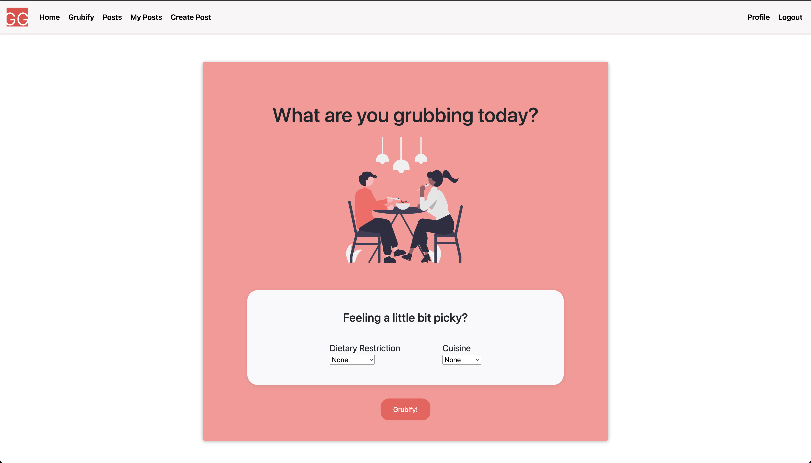
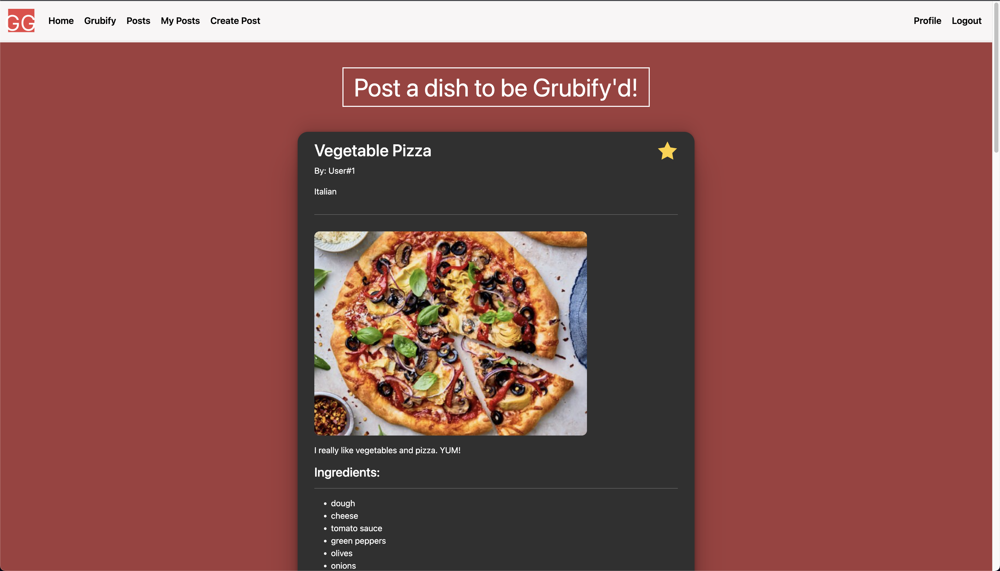
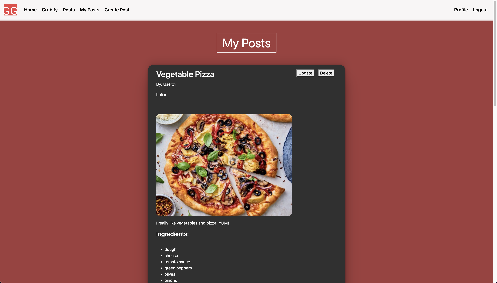
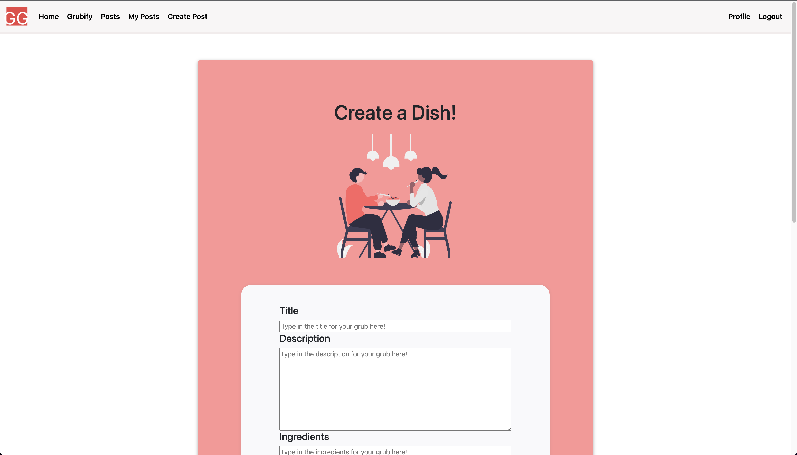
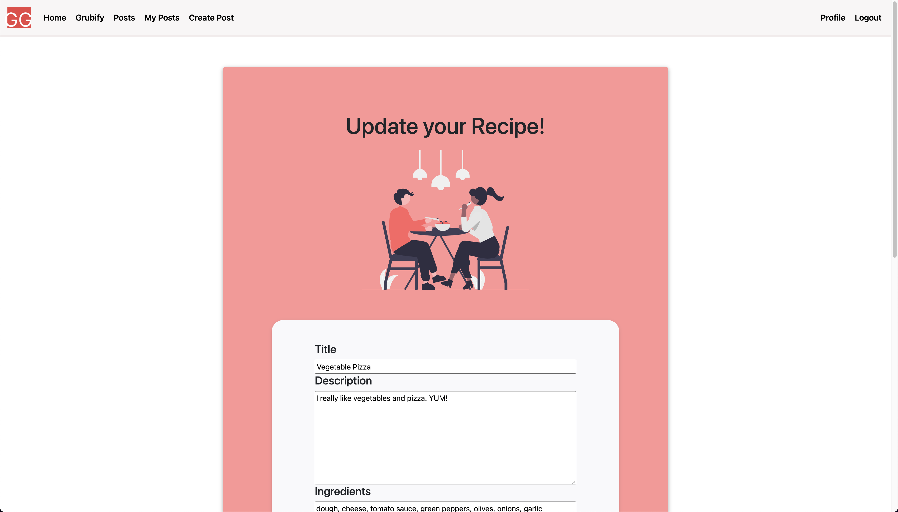
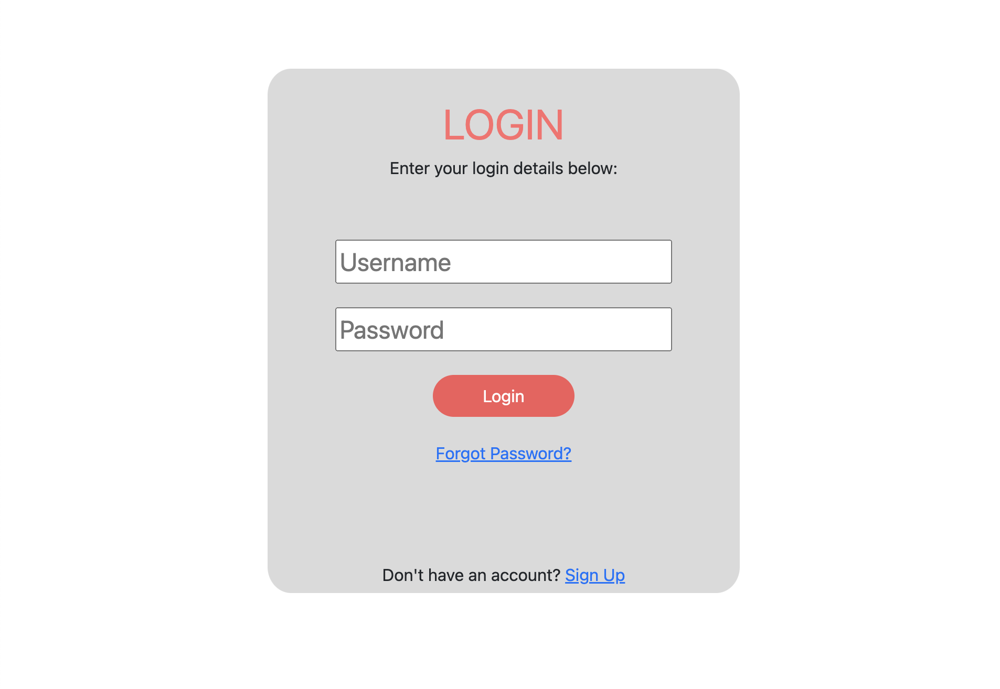
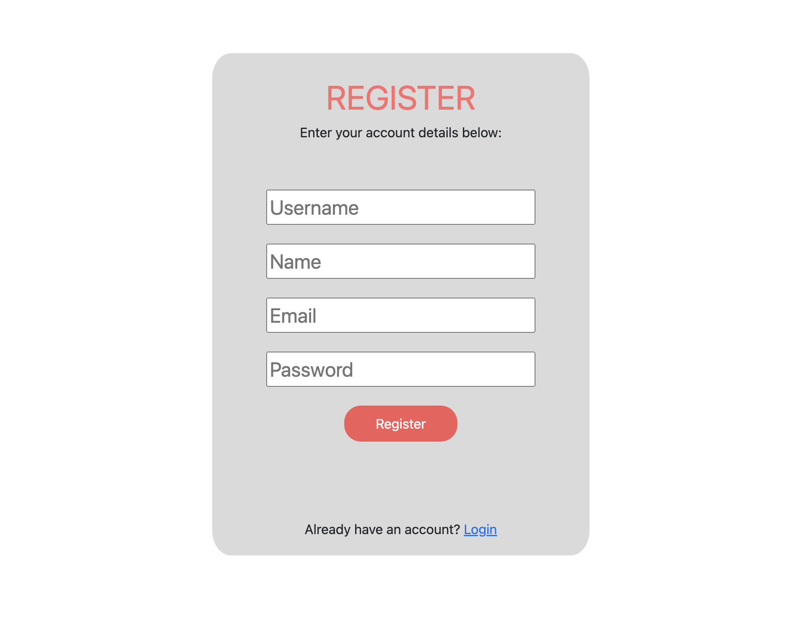

# Title: Team 10 Jabster

# Link: https://grubify-deployment.herokuapp.com/

# Subtitle: Guess my Grub
# Semester: Spring 2022
# Overview: 
Our app is a social media app about Food Recipes. Users are able to make posts about recipes that they know or have made and share them on our web app. The main feature of the app is that users can get a random recipe based on the tags and cuisine they select. This can users decide what to eat or cook when they are having trouble picking food to eat. There are a lot of Recipe Websites out there, but there aren't many that are social media sites that allows users to get random meals based on tags and cuisine and allows them to save their favorites and shopping cart, which makes our app innovative.

# Team Members: 
 Aayush Bhagat (Github: Aayush-Bhagat)  
 Dane Santos (Github: dfsantos-source)  
 Ali Rabeea (Github: alirabeea)  
 Nolan LaRochelle (Github: LaRochelleNolan)  

# User Interface: 

### Homepage
**A view of what the website is about and the mission**


### Grubify
**A view where the user can select the a tag and cuisine and get a random recipe based on the filters**


### Posts 
**A view where the a user can see all of the Recipe Posts that users make**


### My-Posts
**A view where the user can see aall of the recipe posts that you have made**


### Create Post
**A view where the user can create their own recipe post**


### Update Post 
**A view where the user can update a post that they have made**


### Login
**A view where the user can login into their account**


### Register
**A view where a user can register an account for the app**


# APIs:
#### Posts Endpoints

POST create a post `(/posts/create)`:   
Allows a user to create a new Recipe post  
```
    Request Body: {  
        name: String
        cusine: String  
        description: String  
        directions: String  
        ingredients: String  
        tag: String
    }  
```

PUT update a post `(/posts/update/:postId)`:   
Allows user to update their own posts  
```
    Request Body: {  
        name: String
        cusine: String  
        description: String  
        directions: String  
        ingredients: String  
        tag: String
    }  
```
  
DELETE a post `(/posts/delete/:postId)`:  
Allows a user to delete one of their posts   
```
    Params: {
        post_id: number  
    }
```

GET read all posts `(/posts/get/all)`:   
Returns all of the posts from the database so the user can see all posts

GET read all user posts `(/posts/get/user)`:  
Returns all of the posts that specific user has posted

GET read a random post, given a tag and cuisine preference `(/get/random/:tag&:cuisine)`:  
Returns a random post with optional tags and cuisine preferences
```
    Params: {
        tag: String
        cuisine: String
    }
```

GET read a specific post `(/posts/get/:postId)`:   
Returns the posts object for the specific post 
```   
    Params: {
        post_id: number   
    }
```

PUT Like a specific post `(/posts/:postId/like)`:   
Updates the likes and returns the posts object for the specific post. Only occurs if a user has not already liked the post. 
```   
    Params: {
        post_id: number   
    }
```

PUT Dislike a specific post `(/posts/:postId/dislike)`:  
Updates the dislikes and returns the posts object for the specific post. Only occurs if a user has not already disliked the post. 
```   
    Params: {
        post_id: number   
    }
```


#### User Endpoints
 POST register `(/user/register)`:  
 Allows a user to register an account for the web app  
```
Request Body: {  
    username: String
    email: String  
    name: String  
    password: String  
}  
```


 GET Get user data `(/user/get/user)`:  
 Gets a specific user's data  

#### User Authorization Endpoints
POST login `(/login)`:   
Allows a user to log into an account for the web app. Passport.js processes username and password on login.

GET logout `(/logout)`:   
Allows a user to log out of an account for the web app

#### User Favorites Endpoint
 GET read users favorite dishes `(user/favorites/get)`:  
 Gets a user's favorite dishes  


 POST add favorite dish `(user/favorites/add)`:   
 Allows a user to add a dish to their favorites list   
```
Request Body: {
    postId: number   
}
```

 DELETE favorite dish `(user/favorites/delete/:favoriteID)`:   
 Allows a user to remove a dish from their favorites list  
```
Params: {
    favoriteID: number  
}
```

#### User Cart Endpoints
 GET read a cart `(user/cart/user/get)`:   
 Allows a user to get the ingredients from their cart

 POST create an ingredient and add to User cart `(user/cart/user/add)`:   
 Allows a user to add an ingredient to their cart
```
Request Body: {
    name: String
    amount: String
}  
```

 DELETE item from cart `(user/cart/delete/:cartId)`:   
 Allows a user to delete an ingredient from their cart
```
Params: {
    cartId: number  
}   
```

# Database: 

### Users table
Table to keep user data
| Column   | Data Type | Description                         |
| -------- | --------- | ----------------------------------- |
| id       | Integer   | id for users  (Primary Key)         |
| username | String    | the username for the user (UNIQUE)  |
| name     | String    | the users name                      |
| password | String    | THe password the user uses to login |

### Recipe_Posts
Table to keep the Recipes that users create
| Column      | Data Type | Description                                 |
| ----------- | --------- | ------------------------------------------- |
| id          | Integer   | id for Recipe_Posts  (Primary Key)          |
| name        | String    | The name of the recipe                      |
| userID      | Integer   | Foreign Key Ref User id                     |
| Cuisine     | String    | name of the cuisine type of the dish        |
| likes       | Integer   | number of likes the post has                |
| dislikes    | Integer   | number of dislikes the post has             |
| description | String    | description of the dish                     |
| directions  | String    | number of likes the post has                |
| image       | String    | Base 64 String of image data                |
| ingredients | String    | String of all the ingredients               |
| tag         | String    | tag associated with recipe ex: vegan, halal |

### User_Favorites
Table to keep all of the recipe posts a User has favorited
| Column | Data Type | Description                          |
| ------ | --------- | ------------------------------------ |
| id     | Integer   | id for User_Favorites  (Primary Key) |
| userId | Integer   | Foreign Key Ref User id              |
| postId | Integer   | Foreign Key Ref Recipe_Posst id      |

### Cart_Item
Table to keep the items the user needs in a shopping cart
| Column | Data Type | Description                              |
| ------ | --------- | ---------------------------------------- |
| id     | Integer   | id for Cart_Item  (Primary Key)          |
| userId | Integer   | Foreign Key Ref User id                  |
| name   | String    | name of the ingredient for shopping cart |
| amount | String    | amount of the ingredient the user needs  |

### User_Likes
Table to keep all of 
| Column | Data Type | Description                      |
| ------ | --------- | -------------------------------- |
| id     | Integer   | id for User_Likes  (Primary Key) |
| userId | Integer   | Foreign Key Ref User id          |
| postId | String    | Foreign Key Ref Recipe_Post id   |

### User_Disikes
Table to keep all of the recipe posts a User has favorited
| Column | Data Type | Description                         |
| ------ | --------- | ----------------------------------- |
| id     | Integer   | id for User_Dislikes  (Primary Key) |
| userId | Integer   | Foreign Key Ref User id             |
| postId | String    | Foreign Key Ref Recipe_Post id      |

# URL Routes/Mappings: 
| Route        | Authenticated | view              | Description                                                                                                                             |
| ------------ | ------------- | ----------------- | --------------------------------------------------------------------------------------------------------------------------------------- |
| /home        | yes           | hompage view      | Used to route the user to the hompage                                                                                                   |
| /            | yes           | grubify view      | Used to route the user to the grubify page sso they can get random recipes                                                              |
| /login       | no            | login view        | Used to route user to the login page so they can login to the app                                                                       |
| /register    | no            | register view     | Used to route users the register page so users can register an account for the app                                                      |  |
| /all-posts   | yes           | posts view        | route the users to the posts page so that users can see all the recipe posts users have created                                         |
| /my-posts    | yes           | my posts view     | Used to  route users to the my posts page  so user can look at their posts and perform CRUD operations on their posts                   |
| /create-post | yes           | create post view  | Used to route users to the create post view so that users can create their own recipe posts                                             |
| /profile     | yes           | user profile view | used to route users to the user profile view so that users can see theri user info and also see their favorites and their shopping cart |


# Authentication/Authorization: 
Users are authenticated through Passport js. 
To register a user needs to enter: 
``` 
username: String (Unique),
password: String
name: String
email: string
 ```

 To Login a user needs to enter:
 ```
 username: String, 
 password: String
 ```
 And if the credentials match that of the database they will be logged in.

 The user will need to be logged in to access any of the web app besides register and login. Which means that every route (besides login and register) will check if the user is logged in and redirect them to the login page if they are not.

 All users will have the same permissions and no user will have any special permissions.

# Division of Labor: 

#### Aayush Bhagat: 
Designed Recipe and user profile page wireframe and implemented html/css for those pages. Did user and cart item api endpoints. Implemented update posts and my-post.html page for the  front end html and js. Created and intialized database with express backend, user favorites SQL queries and endpoints, User Authentication with Passportjs with Dane, Fixed server bugs, Fixed user profile page integration with backend with Dane.
#### Dane Santos:
Designed Grubify filter page wireframe and implemented html/css for those pages. Extensively debugged and fixed Heroku configuration and deployment. Created and worked on frontend implementation for like and dislike on posts.html, fetched and rendered posts on posts.html, add to cart handlers and fetch calls on user-profile.html. Iitialized database with tables and schema, user shopping cart item Sql queries and endpoints, User Authentication with Passportjs with Aayush, Fixed server bugs, Fixed user profile page integration with backend with Aayush, implemented image base 64 processing.
#### Ali Rabeea:
Designed Login and Register page wireframes and implemented html/css for those pages. Heroku deployment, backend skeleton code for favorites, refactored profile favorites, frontend implementation for favorite post, delete cart and delete favorite from profile page. User register query database, tested backend endpoints with SQL queries and fixed any bugs with queries. Implemented create post, posts, my posts, and update posts page integration with server.
#### Nolan LaRochelle:
Designed Homepage wireframe and implemented html/css for those pages. Handled server endpoints in the backend for getting a random post, getting a specific post based of an id, as well as liking and disliking a post. Also handled the front end the front end javascript for the register page as well as the grubify page.  Implemented Recipe post SQL queries and recipe post backend endpoints, fixed and tested post queries and endpoints, implmented and fixed integration to backend for grubify and register pages. 

# Conclusion: 
Our team has really enjoyed creating this web app throughout the semester, we have enjoyed working as a team together and really liked the project we created. We have learned a lot through implementing and designing this app. We learned a lot about creating our own api and how to design a larger scale api that makes it easy to call endpoints in the frontend. We also learned a lot about SQL through making this app, as we learned how relations work in SQL tables and wee learned SQL queries that allows us to read, update, create , and delete data from the database, we also lerned how to use joins in SQL. The biggest difficulty that we had with this projecct is integrating the front end and backend together. There were a lot of small parts in our application that we needed to integrate such as user likes, that took a while as we would get bugs and didn't know if it was a backend or frontend problem. Our team would have liked to know SQL queries before we began this project, as we had a lot of bugs from our SQL queries when we were setting up the database and also testing the database.