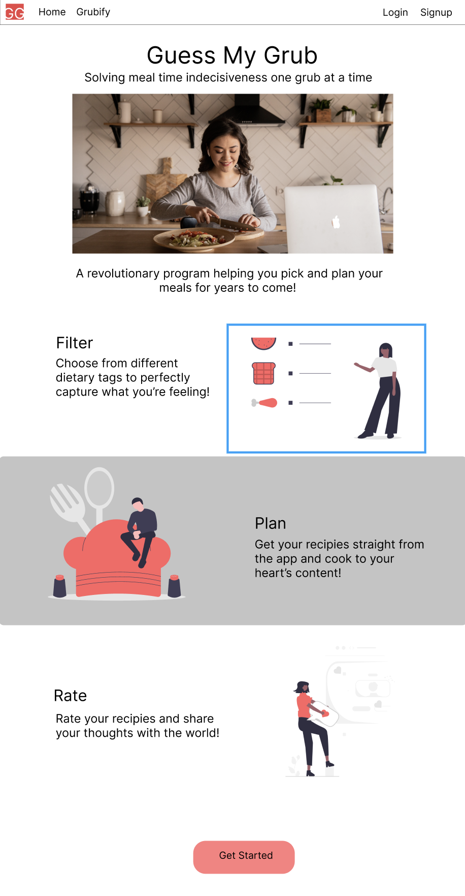
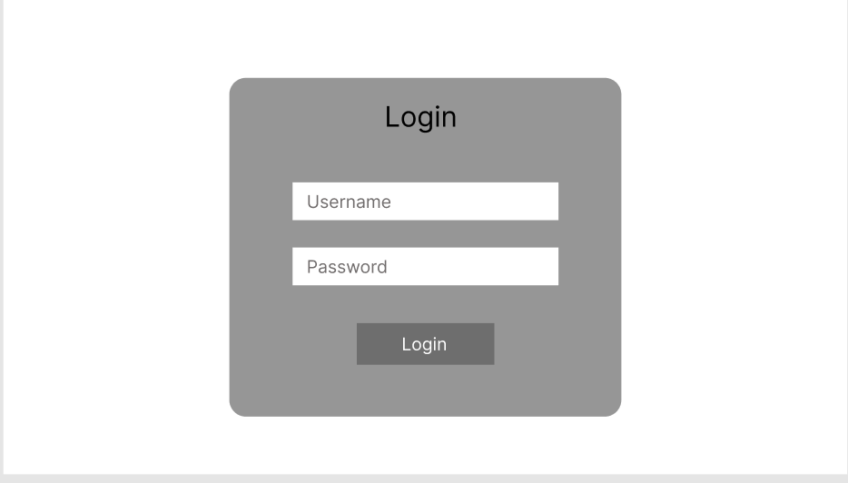
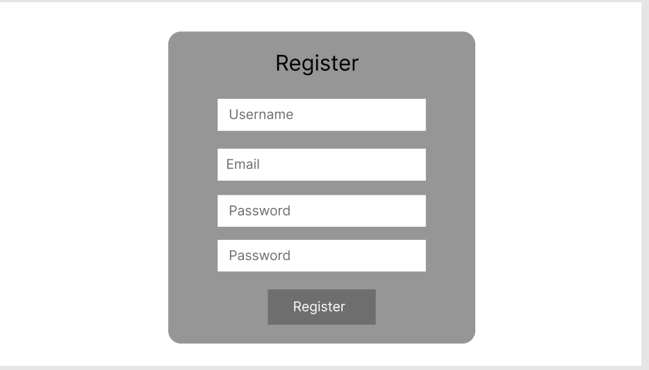
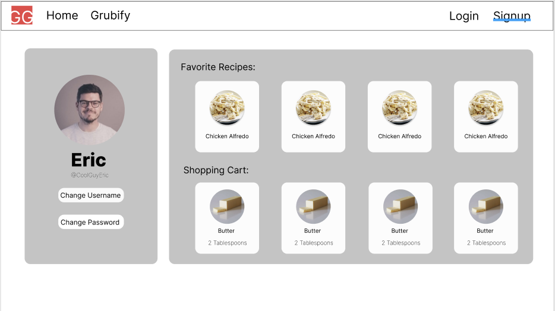
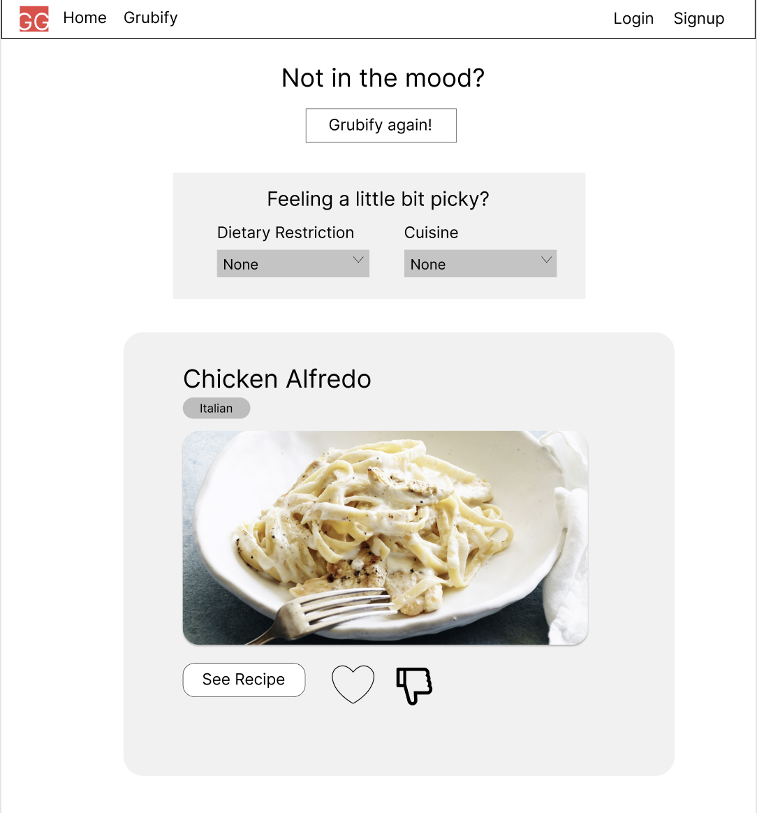
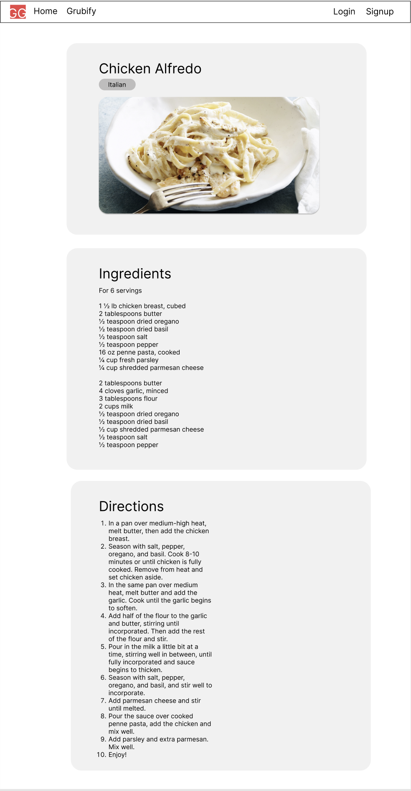

## Data Interactions
- Users will be able to receive a random dish that they can choose to make. 
- Users will be able to input dietary restrictions and preferences, if needed
- Users will be able to see ingredients and direction to cook the food for every recipe
- Users will be able to add and remove ingrediants from their shopping cart
- Users will be able to add and remove recipes to their favorite recipes list
- Users will be able to like and dislike recipes, and users will be able to see the amount of likes and dislikes for each recipe. 
- Users will be able to view and change their profile

## Wireframes

Main homepage. Users will be welcomed to the main page when entering the site. As users scroll down, they'll be welcomed by three different features of the web app with images to compliment them. grubify button at the bottom to start the process. There is also a navbar with links to go back to the home page, grubify page, log in, and sign in pages.

Sign in page. User must input the email and password they used to register in order to access their account.

Registration page. User must input a username, their desired email, and a password as well as a password confirmation in four seperate input boxes to register.

User profile page. This page will have the users account information with options to change their username or password. The page will also display the users saved "Favorite Recipies" as well as a "Shopping Cart" filled with ingrediants they need for desired recipies.

Grubbing Filter. Users will be asked to choose from a list of filters in order to more accurately decide their meal. This includes Dietary Restrictions and Cuisince preferences. Users will then be prompted to hit the grubify button to continue through the process.

Grubbing Filter Expansion. This is another state of the grubbing filter page, where the user will be given drop down menus for both Dietary Restruction and Cuisine options that they can chose from.

Results. The user will be displayed a list of possible options based on the filters the users picked. Each result will display the name, tags, images, options to see the recipe, and rate the meal. There will be an option to grubify again if the user isn't satisfied with the meals listed.

Recipe. The web program will display the user's desired dish's ingrediants and directions on how to prep and cook the meal.