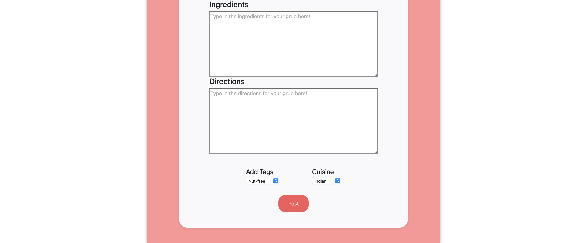

## API

#### Database Schema

#### Posts Endpoints

- POST create a post (/posts/create): Allows a user to create a new Recipe post  
    Request Body : {  
        name: String
        user_id: number  
        cusine: String  
        description: String  
        directions: String  
        ingredients: String  
    }  

- PUT update a post (/posts/update/:postId): Allows User to update their own posts   
        Request Body: {  
            name: String
            cusine: String  
            description: String  
            directions: String  
            ingredients: String  
        }  
  
- DELETE a post (/posts/delete/:postId): Allows a user to delete one of their posts   
    Params:  
    post_id: number  

- GET read all posts (/posts/get/all): Returns all of the posts from the database so the user can see all posts  

- GET a specific post (/posts/get/:postId): Returns the posts objct for the specific post    
    Params:  
    post_id: number   

- GET read a random post (/posts/get/random): Returns a random post from the database  

- PUT like a certain dish (/posts/postId/like): Allows a user to like a post
Params: 
    post_id: number  

- PUT dislike a certain dish (/posts/postId/dislike): Allows a user to dislike a post  
Params:  
    post_id: number  

#### Users Endpoints

- POST login (user/login): Allows a user to login into the web app    
    Request Body {  
        email: String    
        password: String  
    }   

- GET Get user data (user/:id): Gets a specific user's data  

- PUT update user data (user/update/:id): Allows a useer to updaate their credentials  
Request Body: {  
    email: String  
    name: String  
    password: String  
}  

- POST register (user/register): Allows a user to register an account for thee web app  
Request Body: {  
    email: String  
    name: String  
    password: String  
}  

#### User Favorites Endpoint
- GET read users favorrite dishes (user/favorites/:userId/get) Gets a user's favortie dishes  
Params:  
user_id: number    

- POST add favorite dish (user/favorites/:userId/add): Allows a user to add a dish to their favorites list   
Params:  
    user_id: number   

- DELETE favorite dish (user/favorites/:userId/delete/:id): Allos a user to remove a dish from their favorites list  
Params:   
    user_id: number  
    post_id: number  

#### User Cart Endpoints
- GET read a cart (user/cart/:userId/get): Allows a user to get the ingredients in their shopping list  
Params:  
    user_id: number  

- POST create an item and add to User cart (user/cart/:userId/add): Allows a user to add an ingredient to their shopping list
Params:  
    user_id: number  

- DELETE item from cart (user/cart/:userId/delete/:cartId): Allows a user to delete an ingredient from their shopping list  
Params:  
    user_id: number  
    cartId: number  

Interface screenshots

(Create) This part of the interface details the creation of a recipe post on the webite. The users are prompted to insert, in this order, the title of the dish, a desciption of the dish, the ingredients needed to make the dish, and the directions needed to cook the dish to perfection. After the post is created, the post will be inserted into the site's dish database, where users will be able to subsequently access the dish for later use.

(Update) This part of the interface details updating the post that the user creates. The user will be taken to a page constructed similarly with the page for creating a post. The only main difference is that the input fields for each of the section of the post are already fillled in with what was inserted when last working with the post. Users will be able to update whatever aspect they want with the input, and it will be subsequently updated in that specific post's object.

(Read) This part of the interface details the reading of a recipe post on the website after calling the grubify button when searching for recipes. The interface will display the filtered posts, where users will be able to observe all components of the post, as well as the ability to like and dislike the posts.

(DELETE) This part of the interface details the deletion of one of the post cards from the user's favorite recipes list. Upon clicking the trash can image placed at the bottom right of the card, the post will be wiped from the user's set of personal favorite recipes from the wesbite. This ties to its endpoint, where the post will be removed from the user's database of stored personal favorites.

Division of labor:

Dane Santos - Extensively debugged and fixed Heroku configuration and deployment. Created and worked on frontend implementation for like and dislike on posts.html, fetched and rendered posts on posts.html, add to cart handlers and fetch calls on user-profile.html, posts page static html refactor, backend skeleton for CRUD posts and initial template code.

Nolan LaRochelle - Handled server endpoints in the backend for getting a random post, getting a specific post based of an id, as well as liking and disliking a post. Also handled the front end the front end javascript for the register page as well as the grubify page, and the resulting posts that appear as a reseult of the filteing. Handled portion of the readme.

Aayush Bhagat - Did user and cart item api endpoints. Implemented update posts and my-post.html page for the  front end html and js. And also front end implementation for changing password and username and login. 

Ali Rabeea - Heroku deployment, backend skeleton code for favorites, refactored profile favorites, frontend implementation for favorite post, delete cart and delete favorite from profile page.

==============================

Example Client Side Routes (look at client/html/ for other pages)
https://grubify-deploy.herokuapp.com/client/html/posts.html

https://grubify-deploy.herokuapp.com/client/html/user-profile.html

Routing Link
https://grubify-deploy.herokuapp.com/ 